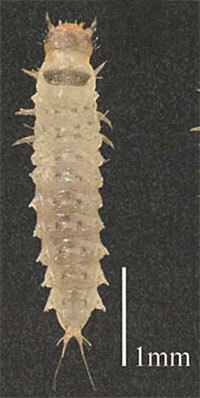
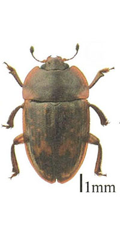
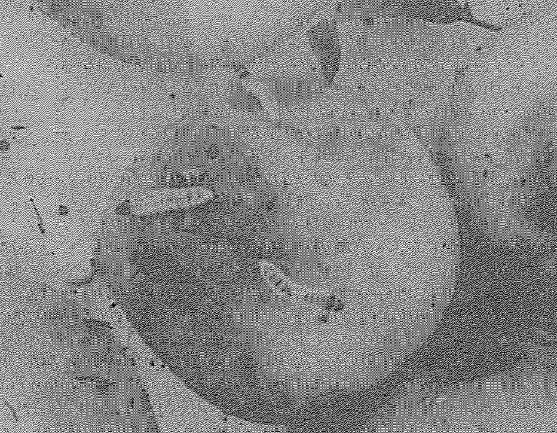

# アカマダラケシキスイ

アカマダラケシキスイ（学名：Ambrosiodmus rubricollis）は，主にカブトムシやカミキリムシなどと同様に木材や果樹（梅）の内部に産卵する甲虫です．以下のように，幼虫と成虫の姿になります．

　

[Source: アカマダラケシキスイの季節消長と生活史](https://agriknowledge.affrc.go.jp/RN/2010936293.pdf)

## 梅の木に侵入する際のプロセスは次の通りです。

アカマダラケシキスイの梅侵入プロセス
- 成虫の飛来と産卵場所の選定：アカマダラケシキスイの成虫は，傷ついた木や弱った木、剪定不良の枝に引き寄せられます．梅の木が病気や剪定ミスで傷んでいる場合，特に狙われやすいです．
- 樹皮への穴あけと産卵：成虫は口や前脚で樹皮に小さな穴を開け，その内部に卵を産みつけます．このとき，傷口や裂け目から侵入することもあります．
- 幼虫の食害：卵から孵化した幼虫は，木材の内部を食い荒らしながら成長します．梅の木の導管を破壊するため，水や栄養の流れが妨げられ，枝枯れや樹勢の低下を引き起こします．
- 成虫への羽化と再侵入：成長した幼虫は成虫に羽化し，新たな産卵場所を求めて飛び立ちます．

## 水浸漬処理によるケシキスイの物理的防除技術

中・間佐古（2009）の実験では，収穫した完熟ウメ果実に，前日からアカマダラケシキスイ終齢幼虫を食入(1果当たり1頭)させておき，合計50果の水浸漬処理を実施した結果，水浸演後45秒で離脱が始まり，23分31秒で果実からすべての幼虫が離脱しました．さらに，8分以上で80%の果実から離脱したこを確認されました．

[Source: 幼虫の離脱状況](https://agriknowledge.affrc.go.jp/RN/2030781856.pdf)

# SWIRカメラによる梅干し内部の観察

SWIRカメラ（高原として1000nm〜1450nm）で梅の内部を観察してみました．照明は，バー照明タイプを利用しました（バックライトタイプの方が望まれます）．

- 複数の梅をスキャンした結果，赤外線で梅の内部が透けて見えます．

<video src="img/1.mp4″ autoplay muted></video>

- 一個の梅をスキャンしました

<video controls src="img/2.mp4" muted="false"></video>

- アカマダラケシキスイが深く入ると見えません．

<video controls src="img/3.mp4" muted="false"></video>

